# Overview
This document details the math underlying Quantum Chess. It provides a basic set of unitaries on which all moves are built, as well as quantum circuit diagrams utilizing those unitaries in movement procedures for each type and variant of move. Finally, it gives an example of how one might extract specific information from the quantum state, via Bell operator expectation values.

# State Representation
The state of the game is divided into two parts, the quantum state and classical information

## Quantum State
The quantum state is described using 64 qubits that encode the "occupancy" of each square. 

   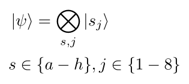

## Classical Information
A classical register is mapped on top of the quantum "occupancy" state, to denote what kind of piece may be in a square.

# Movement Unitaries
All movement is accomplished by applying a specific unitary to the quantum state, and then updating the classical information to reflect the new possible piece locations. The movement unitaries in Quantum Chess are built around the iswap and square root of the iswap.

   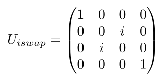 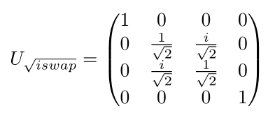

The exact matrix form of each movement unitary will depend on the qubit ordering on which it acts. Movement unitaries are defined as acting on sources, targets, and path qubits:
* **source** refers to a square you're moving from
* **target** refers to a square you're moving to
* **path** refers to an ancilla qubit that encodes the occupancy of all squares between a source and a target. A path is clear if all squares in the path are unoccupied. A path is blocked if any square in the path is occupied. A superposition of boards can lead to a path qubit in a superposition of being clear and blocked.

These terms are for convenience, and are defined under the assumption that there is no superposition. Movement unitaries can be thought of as sometimes moving a piece "backwards", from target to source, when superposition is involved.

All move procedures in the game use one or more of the following movement unitaries.

## Jump
The jump is simply the iswap unitary applied to two qubits.
* s : source
* t : target

   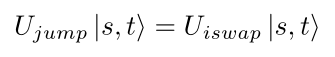

## Slide
The slide acts on three qubits.
* s : source
* t : target
* p : path between source and target

It is a zero-controlled jump between s and t, with p acting as control.

   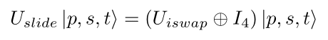

## Split Jump
The split jump acts on three qubits.
* s : source
* t1 : first target
* t2 : second target

It applies the [square root of iswap](#movement-unitaries) between s and t1, followed by an [iswap](#movement-unitaries) between s and t2.

   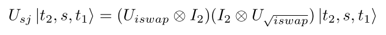

## Split Slide
The split slide acts on five qubits.
* s : source
* t1 : first target
* t2 : second target
* p1 : path from s to t1
* p2 : path from s to t2

It is a sequence of controlled unitaries. If both p1 and p2 are clear, it performs the [split jump](#split-jump) between s, t1 and t2. If p1(2) is blocked, it performs a [jump](#jump) between s and t2(1). If both paths are blocked, it does nothing.

   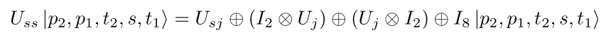

## Merge Jump
The merge jump acts on three qubits.
* s1 : first source
* s2 : second source
* t : target

It is the inverse of a [split jump](#split-jump), and here the qubits are ordered to reflect the inversion.

   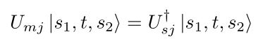

## Merge Slide
The merge jump acts on five qubits.
* s1 : first source
* s2 : second source
* t : target
* p1 : path from s1 to t
* p2 : path from s2 to t

It is the inverse of a [split jump](#split-jump), and here the qubits are ordered to reflect the inversion.

   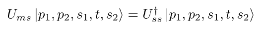

# Measurement
Measurement is used to enforce the "No Double Occupancy" rule. Measurements are designed to allow the game engine to unambiguously determine what type of piece might be occupying any given square after a move. 

All measurements in the game are two-outcome projective measurements, m0 and m1. Each measurement outcome is designed with the following criteria.

* m0 : The state is projected into a subspace where the proposed move is illegal on all boards in the superposition. No further action should be taken.

* m1 : The state is projected into a subspace where the proposed move can be completed, and the piece information for the target square(s) can be updated to match the piece being moved (source piece).

The excluded and capture [variants](./rules.md#move-variants) of each type of move require measurement. The specific form each measurement takes can be seen in [Move Circuits](#move-circuits)

# Move Circuits
The movement unitaries and measurement criteria can be combined into quantum computing circuits for each type and variant of move. These move circuits define the procedure followed for each kind of move.

## Path Control

This circuit can be used to initialize such a [path control qubit](#movement-unitaries) for a path with 3 squares, and is generalizable to any number of squares.

   

The path will be considered unoccupied, p = 0, only if *all* squares in the path are unoccupied.

## Basic Jump
The basic jump is just a simple iswap between source and target.

   

## Excluded Jump
The excluded jump requires measuring to determine the occupancy of the target. The [basic jump](#basic-jump) is then applied if the outcome is m1, meaning the target is unoccupied. Otherwise no unitary evolution occurs.

   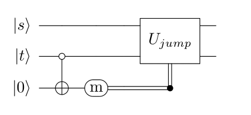

## Capture Jump
An ancilla qubit must be added to the quantum state in order to perform capture in a unitary way. The piece to be captured is first swapped out into the ancilla space. Then a [basic jump](#basic-jump) between source and target is applied.

   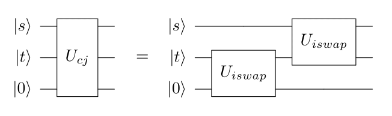

The capture jump requires a measurement to determine the occupancy of the source. The above circuit is applied if the outcome is m1, meaning the source is occupied. Otherwise no unitary evolution occurs.

   

## Basic Slide
The basic slide is a zero-controlled [basic jump](#basic-jump), with the path qubit acting as the control, as described in [Slide](#slide)

   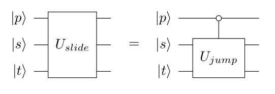

## Excluded Slide
The excluded slide requires measuring to determine the occupancy of the target. The [basic slide](#basic-slide) circuit is applied if the outcome is m1, meaning the target is unoccupied. Otherwise no unitary evolution occurs.

   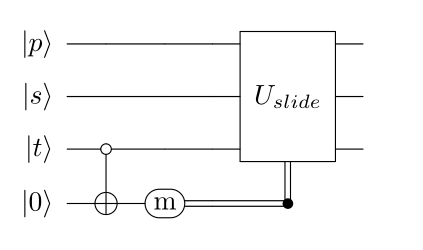

## Capture Slide
The capture slide requires simultaneously measuring to determine the occupancy of both the source and the path. The [capture jump](#capture-jump) circuit is appliedif the outcome is m1, meaning the source square is occupied and the path is clear. Otherwise no unitary evolution occurs.

   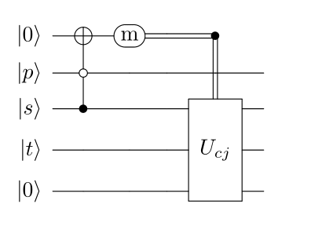

Note, if the measurement outcome is 0, both source and path may still exist in superposition.

## Basic Split Jump
The basic split jump is accomplished with a circuit corresponding to the math described in [Split Jump](#split-jump)

   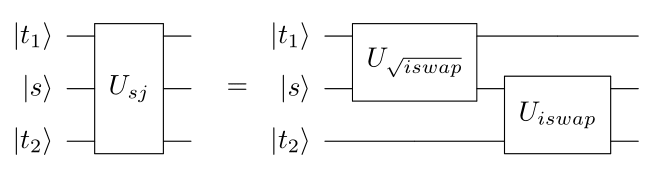

## Basic Split Slide
The basic split slide is accomplished with a circuit corresponding to the math described in [Split Slide](#split-slide)

   

## Basic Merge Jump
The basic merge jump is accomplished with a circuit corresponding to the math described in [Merge Jump](#merge-jump)

   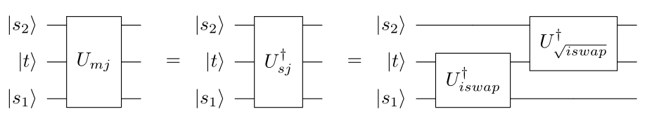

## Basic Merge Slide
The basic merge slide is accomplished with a circuit corresponding to the math described in [Merge Slide](#merge-slide)

   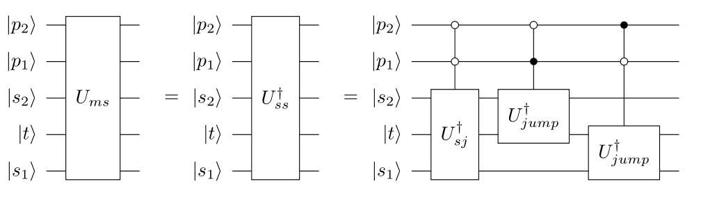

## Basic Pawn Step
The basic pawn step uses the same circuit as the [basic jump](#basic-jump).

## Excluded Pawn Step
The excluded pawn step uses the same circuit as the [excluded jump](#excluded-jump).

## Basic Pawn Two Step
The basic pawn two step uses the same circuit as the [basic slide](#basic-slide).

## Excluded Pawn Two Step
The excluded pawn two step uses the same circuit as the [excluded slide](#excluded-slide).

## Pawn Capture
Pawn capture is similar to the capture jump, except the actual movement of the pawn location is dependent on whether there is is a piece being captured. This can be accomplished with a simple CNOT from target to source, after measurement of the source qubit. Add a phase rotation to maintain consistency with using iSwaps into a captured ancilla.

   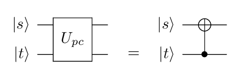

The capture variant requires a measurement projecting the source into the "occupied" subspace.

   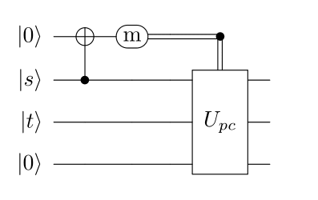

## Basic En Passant
Basic en passant is where the target is either unoccupied, or occupied by a pawn that is the same color as the pawn being moved. Name the square of the pawn being captured 'ep'. The following circuit can be used to complete the basic en passant procedure.

   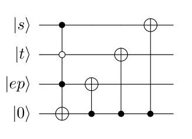

## Excluded En Passant
Excluded en passant is when the target is occupied, in superposition, by a non-capturable piece. It requires the target square to be project into the "unoccupied" subspace.

   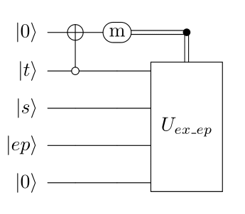

We know the target is not occupied, so the following circuit can be used to complete the en passant procedure.

   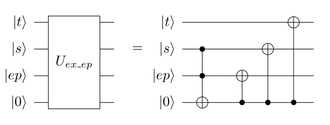

## Capture En Passant
Capture en passant is when the target is occupied, in superposition, by a capturable piece. It requires a measurement projecting the source into the "occupied" subspace.

   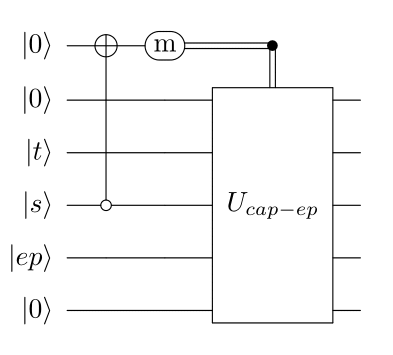

In this case, the pawn is either capturing the piece occupying the target, or capturing the pawn via en passant. We know the source is occupied, so the following circuit can be used to complete the capture en passant procedure.

   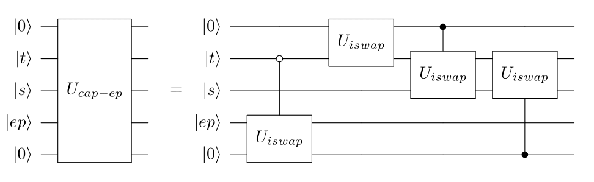

## Basic Kingside Castle
The squares involved in the kingside castle are labeled by their file. It is accomplished by an iswap to move the king, and an iswap to move the rook.

   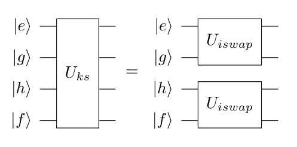

## Excluded Kingside Castle
The excluded variant of the kingside castle requires measuring to project the f-file and g-file squares into the simultaneously unoccupied subspace.

   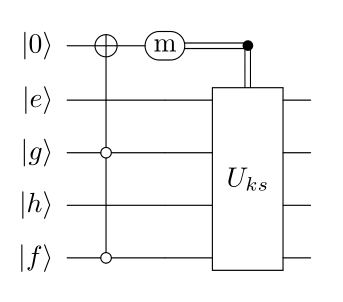

## Basic Queenside Castle
The squares involved in the queenside castle are labeled by their file. It is accomplished by an zero-controlled-iswap to move the king, and an zero-controlled-iswap to move the rook, with the b-file square acting as the control qubit.

   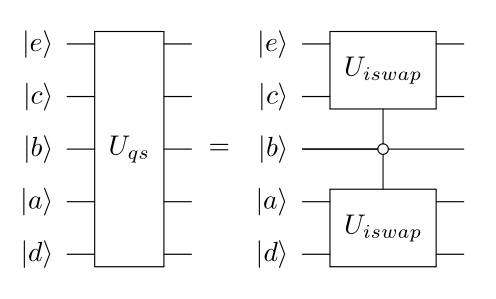

## Excluded Queenside Castle
The excluded variant of the queenside castle requires measuring to project the c-file and d-file squares into the simultaneously unoccupied subspace.

   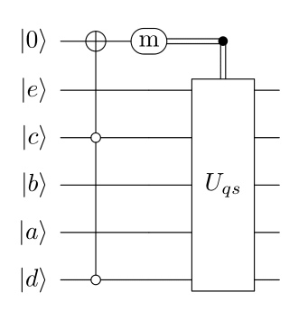

# Bell Correlations
The Bell states, shown here, can be used to extract some correlation information from the quantum state

   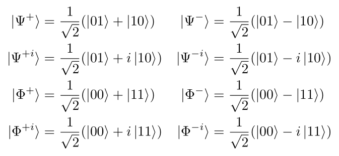

The expectation values of the following operators, for given pairs of squares (qubits) in the quantum state, can be used to gain some sense of entanglement and relative phase.

   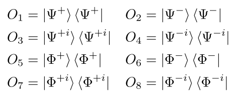

## Entanglement
The Bell states can be separated by their "orientation" of entanglement. The Ψ states support a sense of "oppositeness", if the first square is occupied, then the second is not, and vice versa. Similarly, the Φ states support a sense of "sameness". 

Values for "same" and "opposite" correlation can be calculated by vectorizing the expectation values for the associated Bell operators. The magnitude of each subset of values will tell you whether the state has some preference for sameness or oppositeness. This measure includes both entanglement and classical correlation. The values can be normalized to give some ratio of sameness vs. oppositeness compared to the whole.

   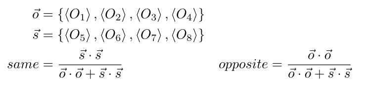

## Phase
Relative phase between two squares can have many interpretions. Consider the relevant information when intepreting the expectation values of the above operators. 

The relative phases for the "opposite" Bell states will tell the player whether a merge move will act as expected. The expectation values of O1, O2, O3, and O4 can be taken directly to show the "amount" of the state that is oriented in each of the 4 "opposite" rotations.
